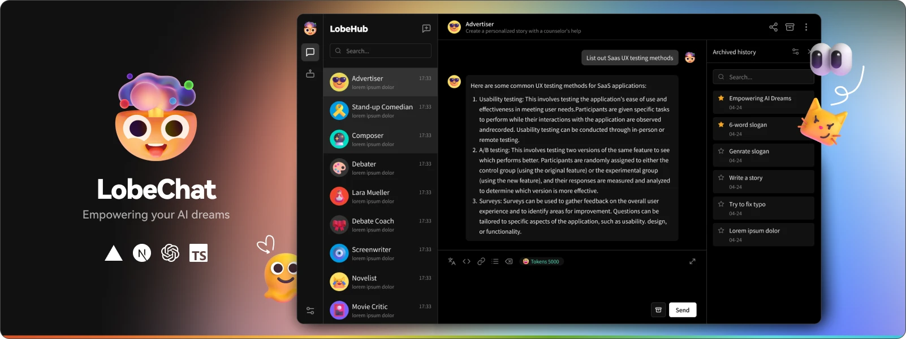
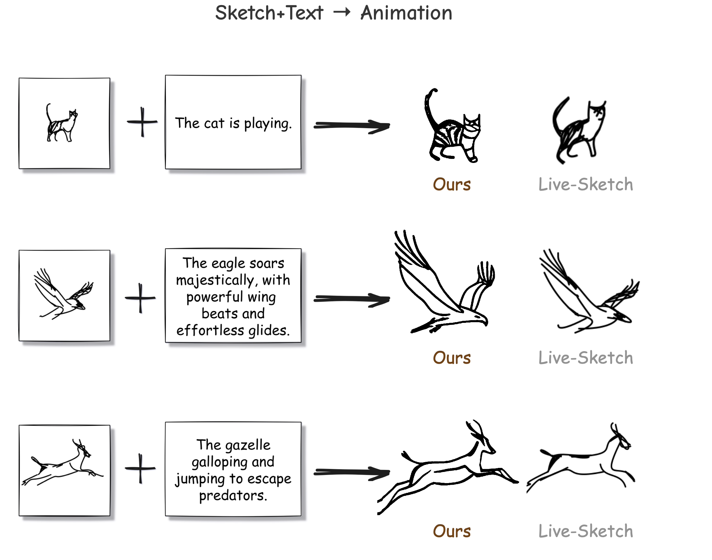
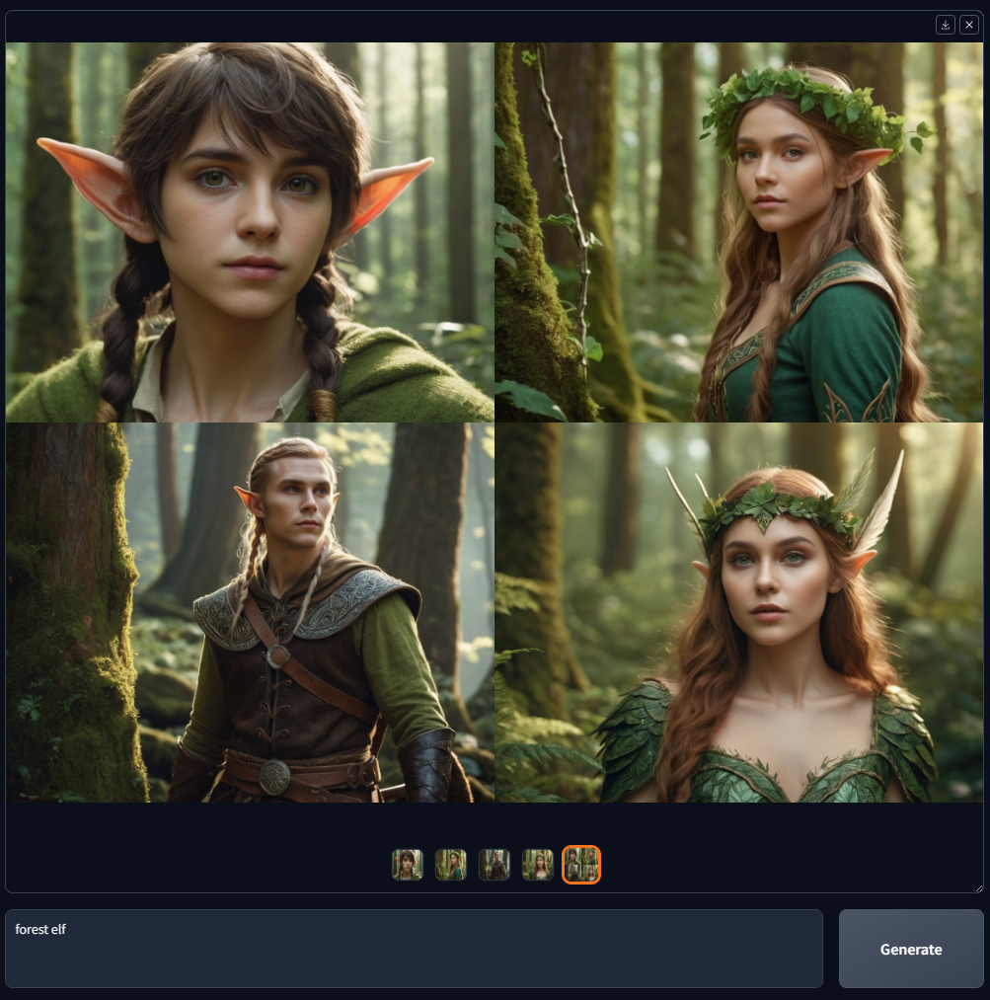
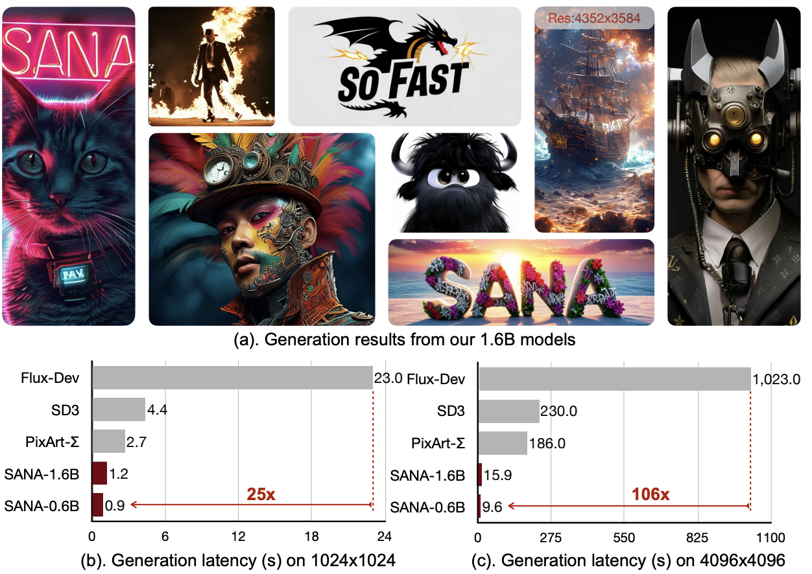
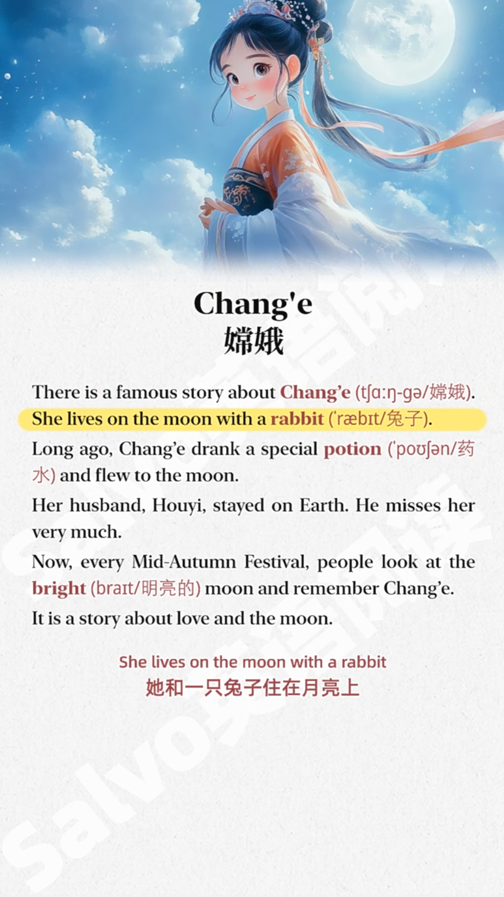

每周精选最具潜力的 AI 开源工具与技术。我们为你解析项目亮点与应用场景，并推荐实用资源，帮助你在 AI 开发中领先一步！无论是学习还是实践，《开源 AIGC 周刊》都是你的每周灵感来源！

## 本周不可错过的 AI 开源项目

1. [Lobe Chat 🌟45.6k](https://github.com/lobehub/lobe-chat)
开源的人工智能聊天框架， 支持多种人工智能模型（OpenAI / Claude 3 / Gemini / Ollama / Azure / DeepSeek）、知识库（文件上传/知识管理/RAG）、多种模式（视觉/TTS/插件/人工智能）。 不仅如此，它还支持PWA, 自定义主题等特性，非常适合一键式免费部署私有 ChatGPT/ Claude 应用程序。

2. [VideoLingo 🌟7.5k](https://github.com/Huanshere/VideoLingo)
全自动视频搬运 AI 字幕组，支持字幕切割、翻译、对齐和添加配音。有搬运海外热门视频需求的话可以试试。

[Demo](https://github.com/user-attachments/assets/25264b5b-6931-4d39-948c-5a1e4ce42fa7)

3. [FlipSketch 🌟195](https://github.com/hmrishavbandy/FlipSketch)
将静态绘图翻转为文本引导的草图动画, 目前出图的效果不是很稳定，但创意不错，有兴趣的话可以翻看下源码。

4. [MinerU 🌟 19.9k](https://github.com/opendatalab/MinerU/blob/master/README_zh-CN.md)
MinerU是一款将PDF转化为机器可读格式的工具（如markdown、json），可以很方便地抽取为任意格式。

[Demo](https://github.com/user-attachments/assets/4bea02c9-6d54-4cd6-97ed-dff14340982c)

5. [Fooocus 🌟41.8k](https://github.com/lllyasviel/Fooocus)
Fooocus 是一款离线、开源和免费的 AI 图像生成软件（基于 Gradio），完全基于 Stable Diffusion XL 架构。与 Midjourney 类似，用户只需关注提示和图像。

6. [SANA 🌟1.2k](https://github.com/NVlabs/Sana)
英伟达开源的文生图模型，优势是生图速度快，能够生成 4k 图片，特别适用于端侧设备。0.6B模型在生成 1024 * 1024 分辨率图片时，仅需 0.9s, 是flux-dev 的 39.5倍。

## 行业动态
1. [阿里通义开源 QwQ-32B-Preview 最强国产推理模型](https://huggingface.co/Qwen/QwQ-32B-Preview)。
QwQ-32B-Preview 是阿里最新开源的推理模型，目前尚在预览阶段，其推理能力非常出众，尤其是数学推理性能上超越了 o1-preview。

2. [ComfyUI 桌面测试版发布](https://blog.comfy.org/open-sourcing-v1-desktop/)。
comfyUI 目前已经开放了测试版的下载地址，支持 Window 和 Mac 平台的安装。目前开源了 V1 beta 版的代码。

3. [Generative Omnimatte：视频分层](https://gen-omnimatte.github.io/)
谷歌推出的视频分层工具，可以将视频分解成一组 RGBA 全色图层，其中每个图层由一个完全可见的物体及其相关效果（如阴影和反射）组成。可以针对每个图层进行编辑，例如去掉物体、更换视频背景等。目前尚未开源。

(lego demo)[https://gen-omnimatte.github.io/assets/videos/layers/lego_animation_pause-occlusion.mp4]

4. [Stable Diffusion 3.5 新增 controlNet](https://stability.ai/news/sd3-5-large-controlnets)
Stability AI 发布了新版 Stable Diffusion3.5Large，新增三种 ControlNet 功能，分别是Blur、Canny和Depth，显著提升了图像生成能力。用户可在不商业化的前提下免费使用该模型。

## 本周 AI 变现思路分享
用 AI 制作小红书 “套路” 视频，通过低成本日更方式持续吸粉，万粉后通过广告、开设店铺或联盟推广的方式变现。

示例：
- **小红书博主**： 【Salvo 英语阅读】 ｜ 8.8W 粉丝 ｜ 仅橱窗变现 2w+💰

- **内容**：AI 英语跟读

📑 通过实用的英文短文 + 美观的配图 + 口语朗读，引发读者的兴趣和关注，后续可开店推英语学习相关产品来实现变现。

- **AI 工具**：GPT + Midjourney + TTS
  - GPT: 寻找爆款短文特点，投喂给 GPT 生成英文短文文本。
  - Midjourney: 生成配图
  - TTS: 生成英文朗读配音

- **案例点评**：
  英语学习类别在小红书上受众很广，易于吸引大量粉丝关注。同时，精心选择的配图也能够直观的提升视频的吸引力。在变现方面，该账号具有较高的商业潜力，包括接商单，带货等。

## 本周 AI 教程/实战
1.[如何使用 Midjourney](https://learningprompt.wiki/docs/midjourney/mj-tutorial-basics/how-to-use-midjourney) 
2.[如何使用 AI 备考雅思](https://learningprompt.wiki/docs/ai-101/best-practice/learning/learning-IELTS)

****

## 关于周刊

开源 AIGC 周刊，为你挑选最值得分享的文章、教程、开源项目、副业变现等内容。希望帮助所有读者学习 AIGC，并增长职业和副业的收入。

周刊在 Github [开源](https://github.com/YOYZHANG/open-source-ai-weekly)，可以通过 issue [投稿](https://github.com/YOYZHANG/open-source-ai-weekly/issues/new)。
