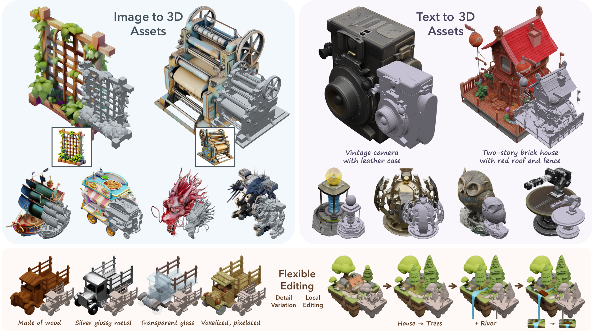
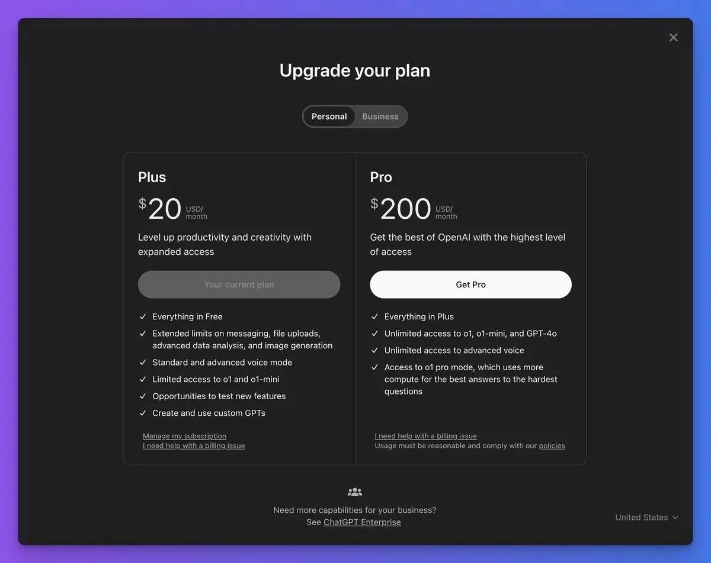
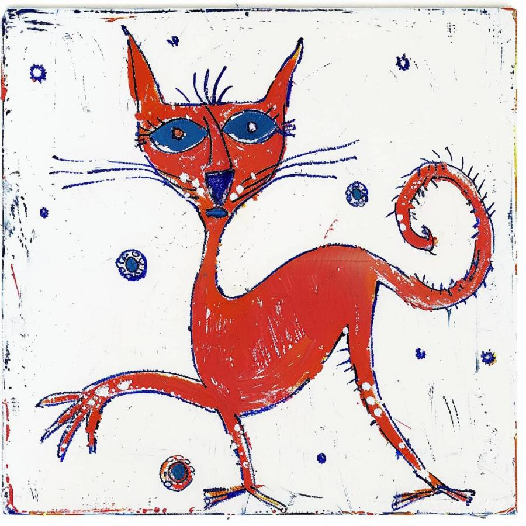
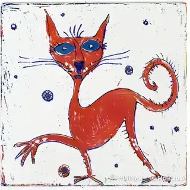
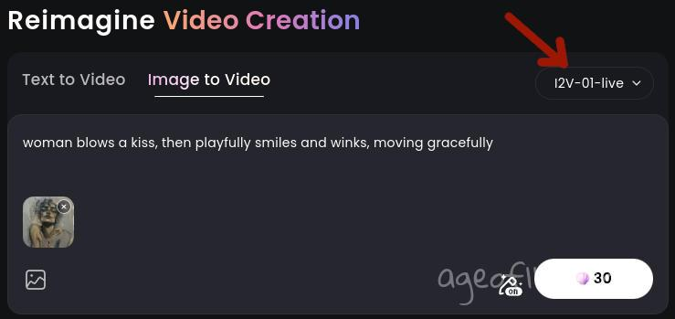
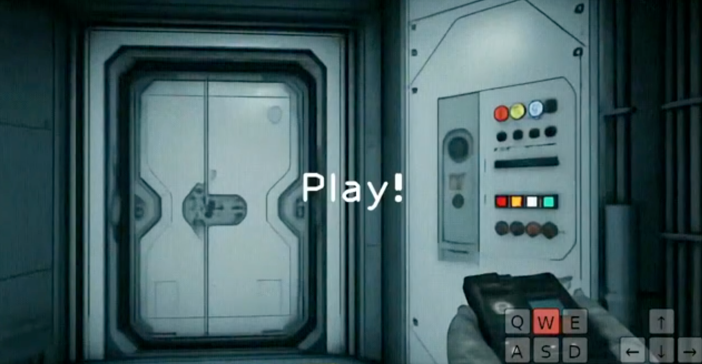
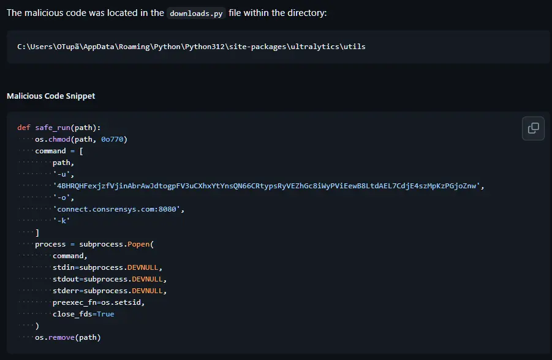

每周精选最具潜力的 AI 开源工具与技术。我们为你解析项目亮点与应用场景，并推荐实用资源，帮助你在 AI 开发中领先一步！无论是学习还是实践，《开源 AIGC 周刊》都是你的每周灵感来源！

## 本周不可错过的 AI 开源项目

### [腾讯混元视频模型 🌟4.7k](https://github.com/Tencent/HunyuanVideo)
腾讯开源了混元视频模型,它在视频生成方面的性能可与领先的闭源模型相媲美，甚至更胜一筹。 它拥有超过 130 亿个参数, 是所有开源模型中最大的模型。 根据专业的人工评估结果，混元视频的性能优于之前的最先进模型，包括 Runway Gen-3、Luma 1.6 和 3 个性能最好的中文视频生成模型。

### [Fish Speech 1.5  🌟16.2k](https://huggingface.co/spaces/fishaudio/fish-speech-1)
Fish Speech 1.5 是由 Fish Audio 研发的基于 VQ-GAN 和 Llama 的多语种语音合成模型。这是一项在 TTS-Arena 排名第二的开源语音合成技术，支持 13 种语言，并提供 150 毫秒以内的低延迟高质量即时语音克隆。

### [MEMO 🌟193](https://github.com/lobehub/lobe-chat)
开源的数字人头项目，能够根据音频生成人物肖像的视频。MEMO 可生成更逼真的谈话视频，涵盖不同的图像和音频类型，在整体质量、音频-唇部同步、身份一致性和表情-情绪一致性方面均优于最先进的方法。

### [GenCast 🌟5.2k](https://github.com/hmrishavbandy/FlipSketch)
GenCast 是谷歌开源的一款天气预报模型，专门用于预测天气和极端天气事件。该模型提供更快、更准确的预报，最远可达 15 天。

### [TRELLIS 🌟 1.9k](https://github.com/Microsoft/TRELLIS)
TRELLIS 是微软开源的一款图片生成3D模型，是提供了多达 20 亿个参数的大规模预训练模型。 TRELLIS 大大超越了现有的3D模型，并展示了灵活的输出格式选择和本地三维编辑功能，这是以前的模型所不具备的。

### [ClearerVoice-Studio 🌟661](https://github.com/modelscope/ClearerVoice-Studio)
ClearerVoice-Studio 是由阿里通义团队开源的人工智能语音处理工具包，支持语音增强、语音分离、目标扬声器提取等功能，且是可商用的协议。

## 最新行业动态

### 1. [OpenAI 12Days Day1: OpenAI o1正式版发布](https://openai.com/12-days/)。

12月5日是 OpenAI Day1, 主要内容包括：
- 完整版 o1（暂无 API 支持）
- o1 pro 模型
- 每月 200 美元（约合 1450 人民币）的 ChatGPT Pro 订阅服务

ChatGPT Pro权益是提供了无限制访问高级语音模式、o1、4o 以及全新的 o1 pro 模型的特权，一般人应该用不上。

### 2. [Hailuo I2V-01-Live](https://github.com/ltdrdata/ComfyUI-Impact-Pack/issues/843)

海洛 I2V-01-Live 是 I2V 系列的最新成员，它专门针对动漫图片，让角色以前所未有的方式移动、说话。

可以在 Creation Box 中创建自己的 I2V-01-Live 动画：

### 5. [谷歌 Genie 2：AI 生成无尽可操作的游戏世界](https://deepmind.google/discover/blog/genie-2-a-large-scale-foundation-world-model/)

 Genie 2 是由谷歌开发的大型世界模型，基于单张图片即可生成无尽的可操作和交互式 3D 游戏世界。用户可以通过键盘和鼠标控制这些生成的世界，主要用于训练或评估 AI agent。

### 6. [警惕：ComfyUI热门插件Impact-Pack被植入病毒](https://github.com/ltdrdata/ComfyUI-Impact-Pack/issues/843)

ComfyUI-Impact-Pack 插件依赖的 ultralytics 包被恶意植入了挖矿病毒，这几乎是一个必装的插件。如果你正在使用，请务必立即卸载。或可以直接通过 GitHub 安装 ultralytics 这个依赖，或者使用 8.3.43 版本，具体可以查看 [843](https://github.com/ltdrdata/ComfyUI-Impact-Pack/issues/843)。

### 7. [Meta发布 LLaMA 3.3 70B](https://huggingface.co/meta-llama/Llama-3.3-70B-Instruct)。

Meta 正式发布了Llama 3.3 70B，这款模型支持 128K 的上下文窗口，具备多语言能力，并且增强了工具调用功能。
与 Llama 3.1 70B 相比，其性能有了显著提升，部分基准测试结果甚至可与 Llama 405B 媲美。

## 关于周刊

开源 AIGC 周刊，为你挑选最值得分享的文章、教程、开源项目、副业变现等内容。希望帮助所有读者学习 AIGC，并增长职业和副业的收入。

周刊在 Github [开源](https://github.com/YOYZHANG/open-source-ai-weekly)，可以通过 issue [投稿](https://github.com/YOYZHANG/open-source-ai-weekly/issues/new)。
