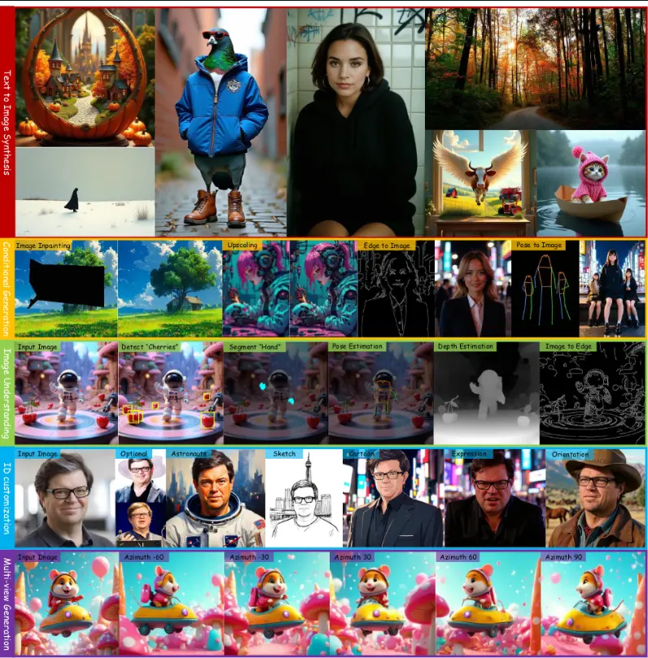
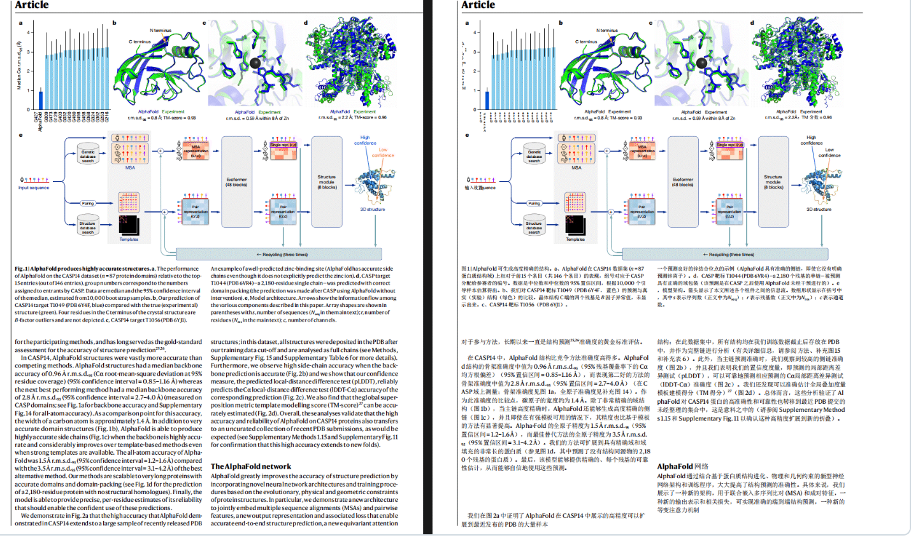
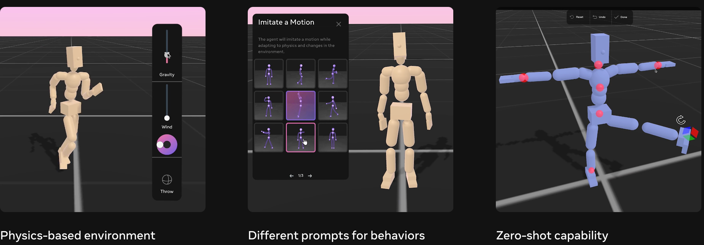
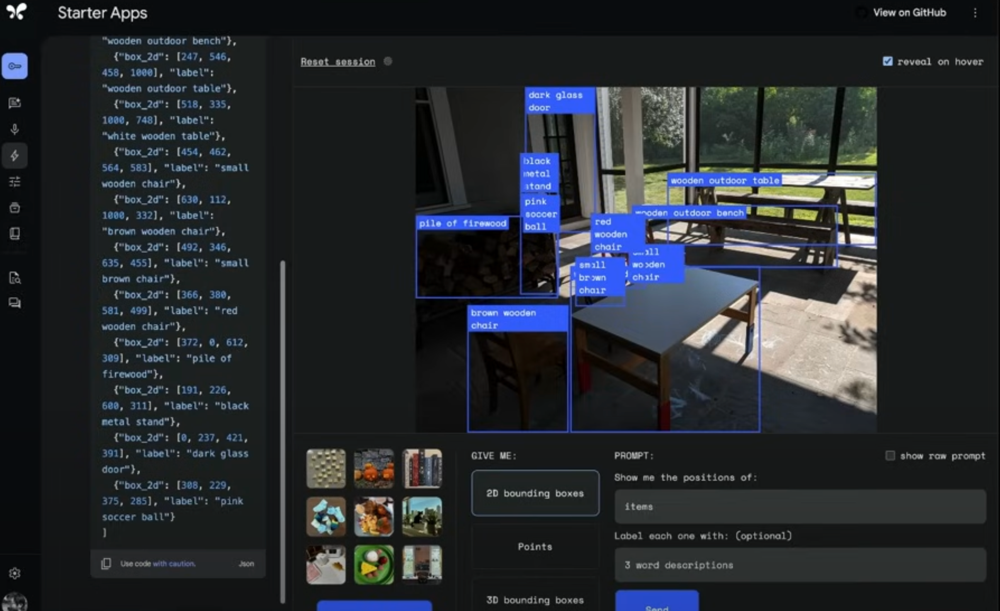
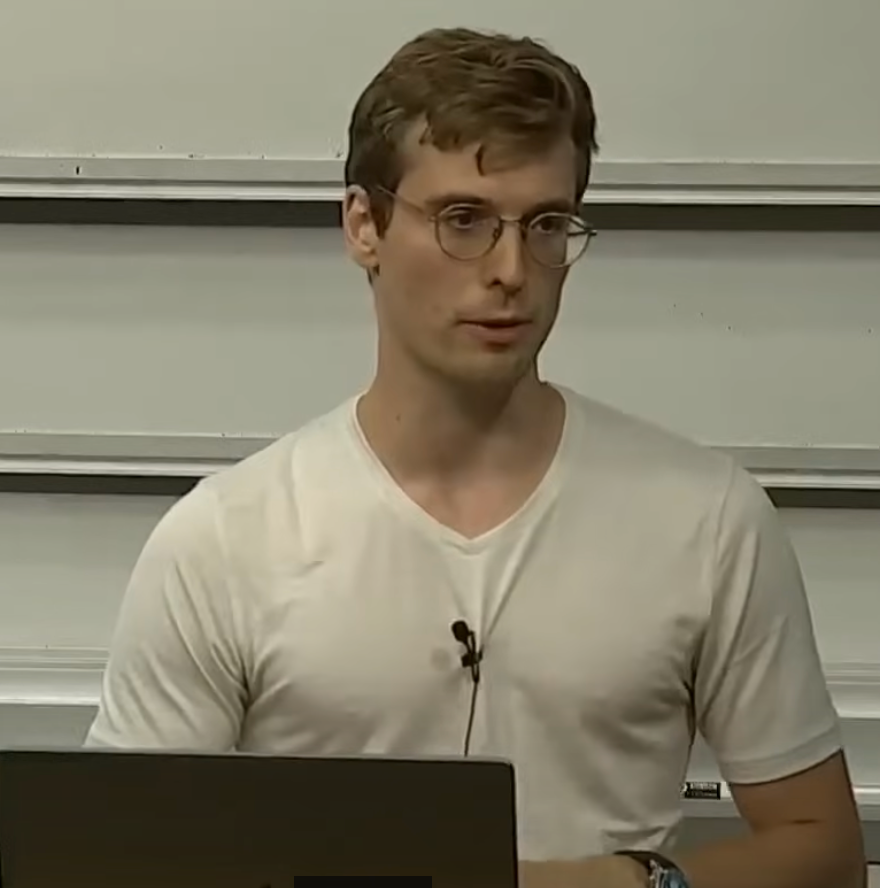

每周精选最具潜力的 AI 开源工具与技术。我们为你解析项目亮点与应用场景，并推荐实用资源，帮助你在 AI 开发中领先一步！无论是学习还是实践，《开源 AIGC 周刊》都是你的每周灵感来源！

## 本周不可错过的 AI 开源项目

### [screenshot-to-code  🌟65.4k](https://github.com/abi/screenshot-to-code)
一款使用 AI 将屏幕截图、模型和 Figma 设计转换为简洁实用的代码的简单工具。现在支持 Claude Sonnet 3.5 和 GPT-4o。还可拍摄网站运行时的视频/屏幕录像，并将其转化为功能原型。

### [OneDiffusion：功能强大的生图模型 🌟 476](https://github.com/lehduong/OneDiffusion?tab=readme-ov-file)

OneDiffusion 是一个多功能生图模型，功能非常强大，目前支持文生图、ID 一致性、单图生多视角、文生多视角、根据主题生成等多种功能。

### [RAGFlow  🌟 25.3k](https://github.com/infiniflow/ragflow)
RAGFlow 是一款基于深度文档理解构建的开源 RAG 引擎。它可以为各种规模的企业及个人提供一套精简的 RAG 工作流程，针对用户各类不同的复杂格式数据提供可靠的问答以及有理有据的引用。

### [PDFMathTranslate 🌟4.2k](https://github.com/Byaidu/PDFMathTranslate/tree/main)
PDFMathTranslate 能够将PDF文档进行双语翻译，并完整保留排版。支持 Google/DeepL/Ollama/OpenAI 等服务，提供 CLI/GUI/Docker。

### [HivisionIDPhotos 🌟 1.4k](https://github.com/Zeyi-Lin/HivisionIDPhotos)
HivisionIDPhoto 是一个轻量级的AI证件照制作算法，完全开源免费，利用一套完善的AI模型工作流程，来实现对多种用户拍照场景的识别、抠图与证件照生成。

### [metamotivo 🌟 278](https://github.com/facebookresearch/metamotivo)
Meta Motivo 是首个人体动作生成模型，能够控制并生成符合物理规律的人体动作，还蛮有意思的。

## 最新行业动态
### 1. [OpenAI 12Days Day3-6](https://openai.com/12-days/)
OpenAI Day3：
- Sora正式发布, 它是一款文生视频生成模型。现在已经可以通过 http://sora.com 来登录访问。
- ChatGPT Plus用户（20美元/月），每月最多生成50个视频，5秒720P分辨率，有水印。
- ChatGPT Pro用户（200美元/月），每月最多优先生成500个视频，1080P最多10秒，720P可以生成20秒，无水印。

OpenAI Day4:
- 推出了全新的 ChatGPT Canvas。新 Canvas 支持与 ChatGPT 实时协作编程、写作。

OpenAI Day6:
- 推出了高级语音模式，并新增了 Vison 能力。用户可以将相机或屏幕的实时内容分享给 ChatGPT。

### 2. [谷歌 Willow：量子芯片的划时代突破](https://blog.google/technology/research/google-willow-quantum-chip/)

Google 推出的 Willow 是一款划时代的量子芯片，它在量子错误校正方面取得了重大突破，Willow 能够在不到五分钟的时间内完成一项基准计算，而这需要当今最快的超级计算机需花费 10^25年的时间。同时Willow 通过提升量子位的数量，可以成倍降低计算的错误率。

官方博客：https://blog.google/technology/research/google-willow-quantum-chip/

谷歌出的量子计算免费课程：https://coursera.org/learn/quantum-error-correction

### 3. [谷歌发布 Gemini2.0 Flash Experimental](https://developers.googleblog.com/en/the-next-chapter-of-the-gemini-era-for-developers/)

Gemini Flash 2.0 堪称最强大模型，它的速度是 1.5 Pro 的两倍，这款新一代AI模型在多模态功能上进行了显著改进，可用于构建具有实时音频和视频流的动态应用程序。

### 4. [Grok 向所有用户免费开放](https://x.ai/blog/grok-1212)

Grok 对所有用户免费，包含新推出 Grok2版本。Grok2不仅支持实时搜索，还支持绘图，分析帖子等，不愧是马斯克送出的圣诞大礼。

### 5. [PIKA AI 发布 Pika 2.0](https://pika.art/login)

PIKA AI 发布Pika 2.0 模型。模型支持上传商品或衣服照片可以实现试穿试用，上传两个人的照片可以轻松实现合影等。看效果确实不错，非常适合生成广告片，宣传视频等。

### 6. OpenAI 服务大规模宕机超 4 小时
12月10日，OpenAI 遭遇了大规模宕机，包括 API、网站、Sora 和 Playground 在内的服务均无法使用，宕机时间超过 4 小时。截至目前，所有服务已完全恢复。

## 本周 AI 教程
1.[斯坦福 AI 公开课：如何建立类似 ChatGPT 的模型](https://www.youtube.com/watch?v=9vM4p9NN0Ts&t=72s)

这门公开课被认为是2024年最值得收藏的斯坦福 AI 公开课。本课程简明扼要地概述了如何建立类似 ChatGPT 的模型。即使没有编程基础也能搞懂大模型是如何运作的，是很好的 AI 基础教程。

## 关于周刊

开源 AIGC 周刊，为你挑选最值得分享的文章、教程、开源项目、副业变现等内容。希望帮助所有读者学习 AIGC，并增长职业和副业的收入。

周刊在 Github [开源](https://github.com/YOYZHANG/open-source-ai-weekly)，可以通过 issue [投稿](https://github.com/YOYZHANG/open-source-ai-weekly/issues/new)。
