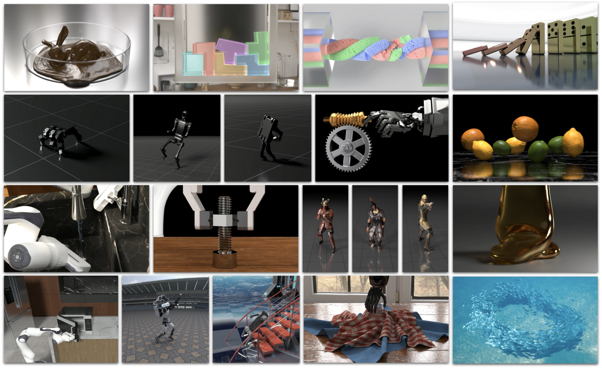
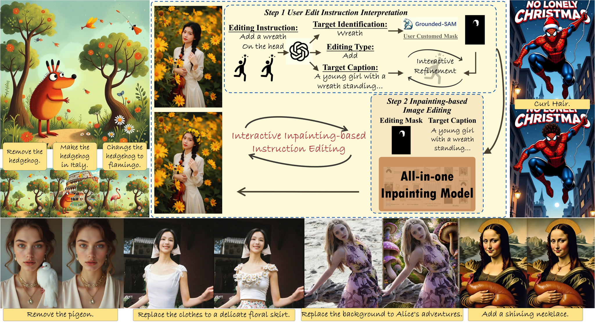
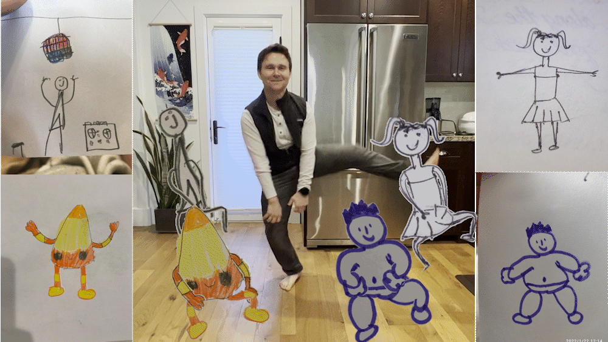
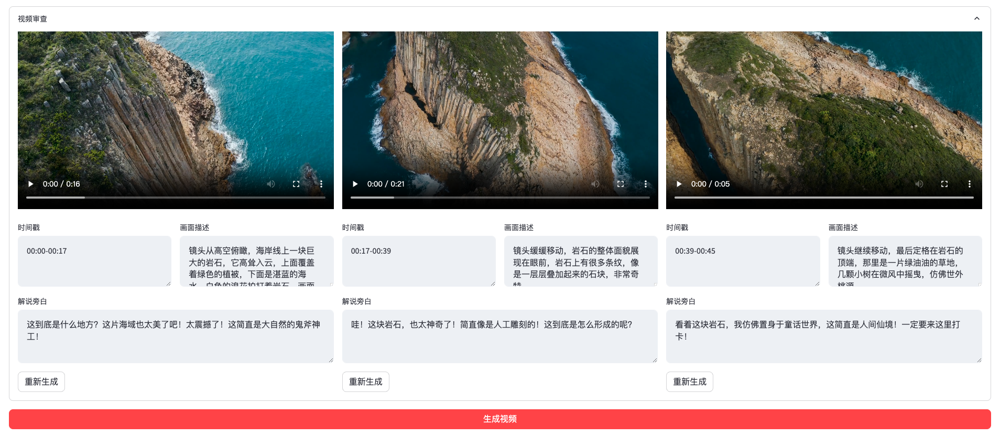

每周精选最具潜力的 AI 开源工具与技术。我们为你解析项目亮点与应用场景，并推荐实用资源，帮助你在 AI 开发中领先一步！无论是学习还是实践，《开源 AIGC 周刊》都是你的每周灵感来源！

## 本周不可错过的 AI 开源项目

### [Genesis 🌟 17.8k](https://genesis-embodied-ai.github.io/)

genesis 是一个综合性物理模拟平台，亮点是能够模拟各种材料和物理现象，能够生成复杂的人物动作，以及3D人物表情。上线短短4天已有 17.8k star，关注度可见一斑。目前物理引擎和模拟平台已开源，生成模型尚未开源。

### [BrushEdit  🌟 347](https://github.com/TencentARC/BrushEdit)
BrushEdit 是腾讯开源的一体化图像编辑和修复技术。用户可以轻松移除对象、添加对象，进行背景编辑和对象替换。

### [CosyVoice 🌟8.6k](https://github.com/FunAudioLLM/CosyVoice)
CosyVoice是一款多语言大型语音生成模型，提供推理、训练和部署全栈能力。从官方提供的Demo(https://funaudiollm.github.io/cosyvoice2/) 来看效果还不错，感兴趣可以试试。

### [Facebookresearch 🌟 11.8k](https://github.com/facebookresearch/AnimatedDrawings)
facebookresearch 是一款开源的能让手绘人物动起来的工具，非常适合做表情包等。

### [NarratoAI 🌟 2.6k](https://github.com/linyqh/NarratoAI/tree/main)
NarratoAI是一站式 AI 影视解说+自动化剪辑工具🎬🎞️，它基于LLM实现文案撰写、自动化视频剪辑、配音和字幕生成的一站式流程，快速生产内容，感兴趣的可以试试。

### [ColorFlow  🌟163](https://github.com/TencentARC/ColorFlow)
腾讯推出的一款图片上色应用，用户可以通过上传多张风格参考图，为线稿完成上色。官方提供了在线试用地址，感兴趣的话可以试试。

## 最新行业动态
### 1. [OpenAI 12Days Day6-12](https://openai.com/12-days/)
OpenAI Day12：
- OpenAI 发布 o3模型，推理能力实现质的飞跃。官方预计在 2025年初正式上线。

OpenAI Day11:
- 展示了 ChatGPT 桌面应用与其他应用的协作。用户可以在 VSCode、Notion 等应用中直接与 ChatGPT 互动。

OpenAI Day10:
- 展示了可以打电话和发短信给ChatGPT.

OpenAI Day9:
- 推出了 o1 推理模型的 API, 支持函数调用和结构化输出。

### 2. [谷歌推出 Gemini 2.0 Flash Thinking](https://x.com/JeffDean/status/1869789813232341267)

这是一款能明确显示其思维的实验模型，它提供了完整的思考步骤。目前可以在 AI Studio 上免费使用，API 也是免费的，每天 1500 次。

### 3. [GitHub Copilot 推出免费版本](https://github.blog/news-insights/product-news/github-copilot-in-vscode-free/)

GitHub Copilot 现在推出了免费订阅版本，用户可以享受所有支持的模型，但每月最多只能使用 2000 个自动完成和 50 个 Chat 请求。不过，教育和开源开发者依然可以无限制访问。

### 4. [快手发布KLING AI 1.6](https://x.com/bdsqlsz/status/1869652575324393723)
快手发布 KLING AI 1.6 版本，该版本在提示词遵循、视觉美观和物理特效方面都有显著改进。
此外，1.5 模型也更新支持了标准模式和 720p 文生视频，比 Sora 强。

### 5. [字节推出豆包视觉理解模型](https://www.volcengine.com/docs/82379/1362931)

豆包视觉理解模型给豆包安上了 "眼睛"，可以用手机摄像头展示实时画面，直接像豆包模型提问。从演示视频上看，模型的内容识别、理解和推理能力以及记忆能力都表现出色。
API 现已上线火山引擎，免费提供 50 万 token，最便宜的 lite 模型，输入输出分别为 1.5 元、4.5 元/M token。

### 6. 谷歌推出 Veo2：顶级视频生成模型
谷歌发布了 Veo2 视频模型，支持文生视频和图生视频。该模型能够生成分辨率高达 4K 的视频，并能根据提示词完成相机控制，如广角镜头、POV 和无人机拍摄，更好地遵循物理效果。
从官方演示来看，效果非常出色，甚至优于 Sora。目前，还需要加入 VideoFX 的候补名单才有机会体验。

## 本周 AI 教程
1.[llm 资料合集 🌟 19.6k](https://github.com/Hannibal046/Awesome-LLM)

超全的llm资料仓库，按发布时间整理了所有 llm 相关的里程碑论文。不仅如此，它还包含 LLM 训练框架、部署 LLM 的工具、有关 LLM 的课程和教程以及所有公开可用的 LLM 检查点和 API。

## 关于周刊

开源 AIGC 周刊，为你挑选最值得分享的文章、教程、开源项目、副业变现等内容。希望帮助所有读者学习 AIGC，并增长职业和副业的收入。

周刊在 Github [开源](https://github.com/YOYZHANG/open-source-ai-weekly)，可以通过 issue [投稿](https://github.com/YOYZHANG/open-source-ai-weekly/issues/new)。
