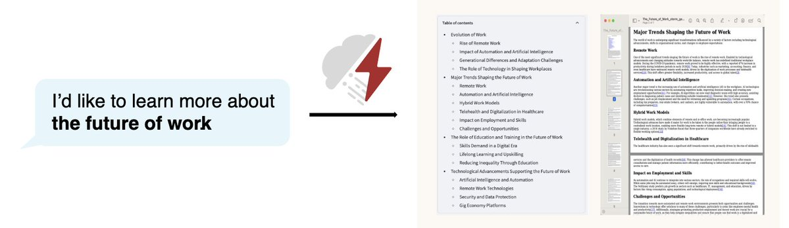
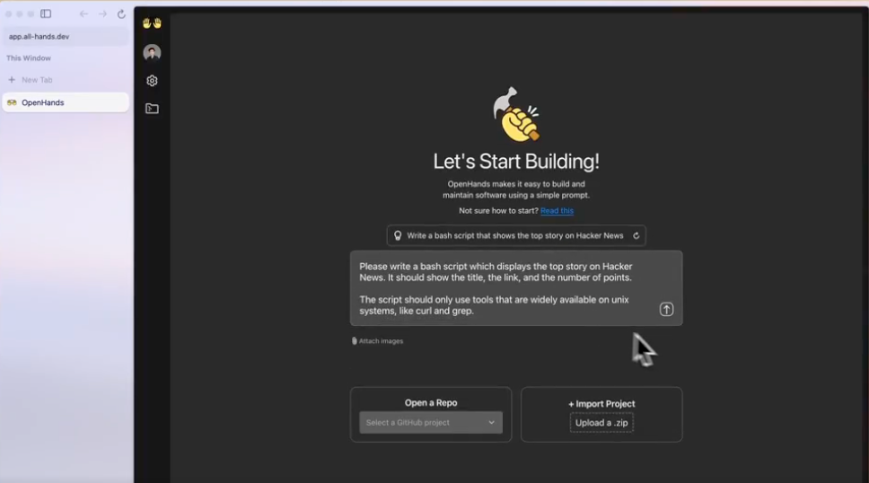
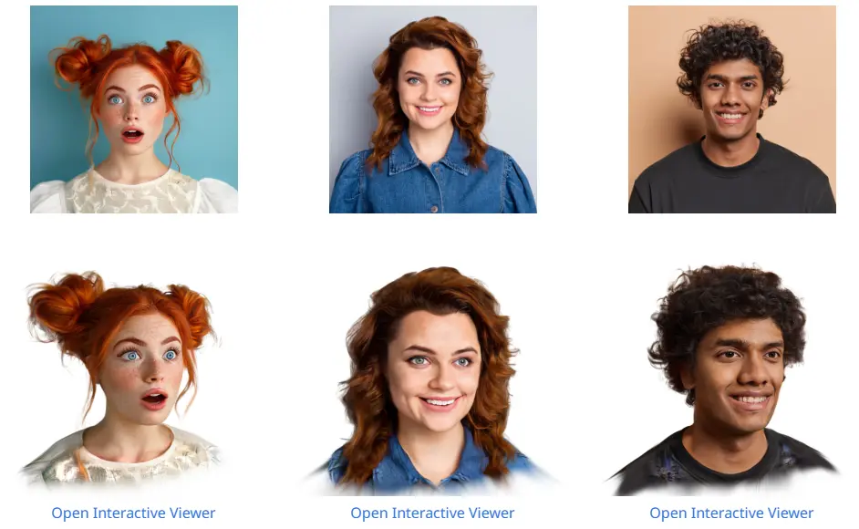
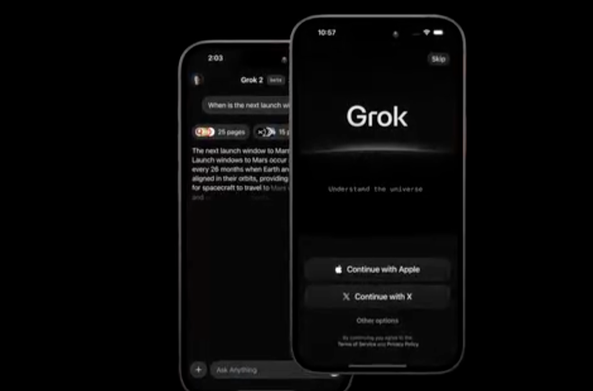
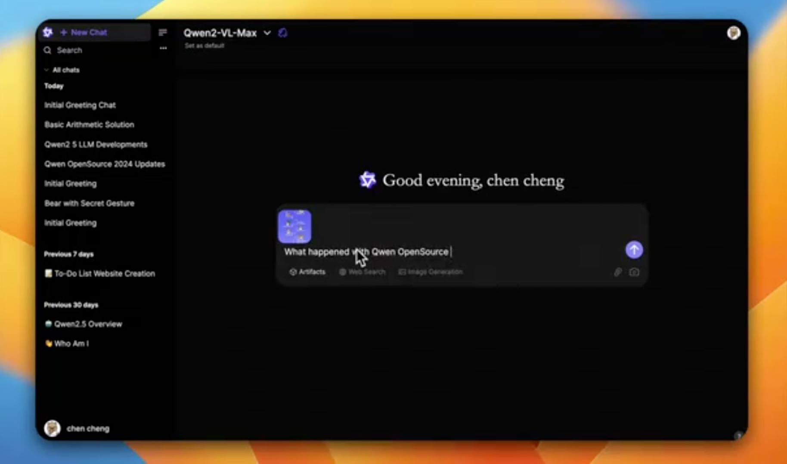
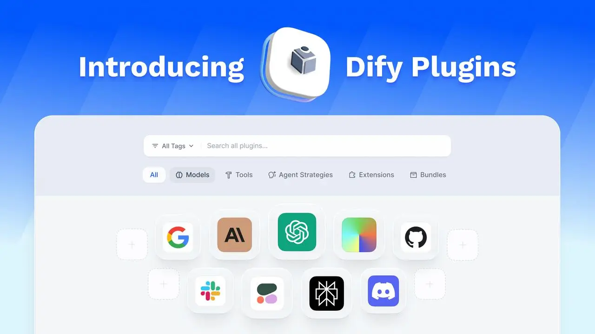
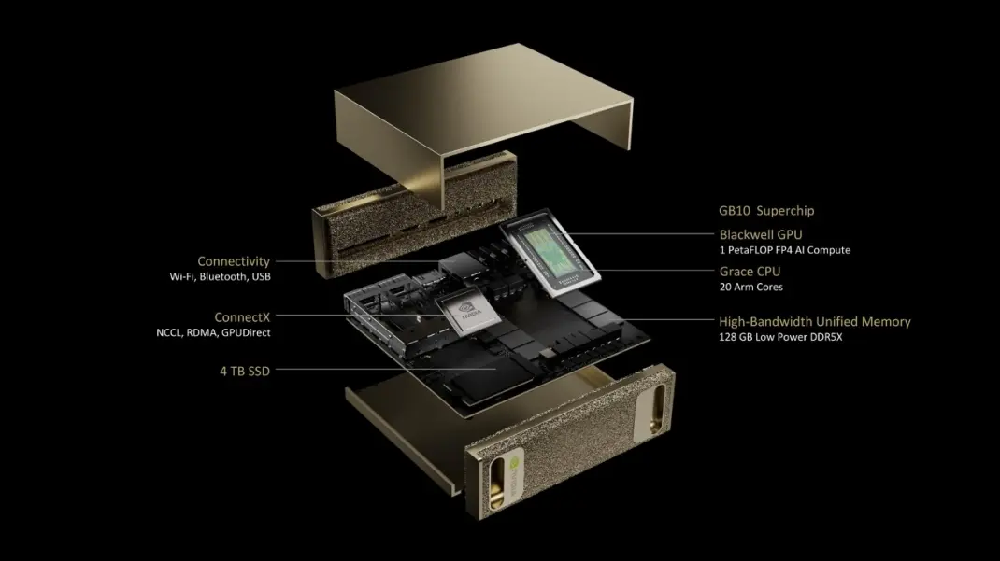

每周精选最具潜力的 AI 开源工具与技术。我们为你解析项目亮点与应用场景，并推荐实用资源，帮助你在 AI 开发中领先一步！无论是学习还是实践，《开源 AIGC 周刊》都是你的每周灵感来源！

## 本周不可错过的 AI 开源项目

### [微软开源 phi-4 模型：14B 参数，性能超越 GPT-4o 🌟 1.1k](https://huggingface.co/microsoft/phi-4)
phi-4 是微软刚刚开源的最强小参数模型，其参数仅为 14B。

在各种基准测试中，phi-4 对比同参数量的模型表现优异，甚至在 GPQA 和 MATH 基准测试中超过了 GPT-4o。

### [SAI 开源 SPAR3D：一秒内从单图生成可编辑 3D 模型 🌟 396](https://github.com/Stability-AI/stable-point-aware-3d)

SPAR3D 是 SAI 最近开源的一项图生 3D 技术，能够在短短一秒内从单张图片生成可编辑的 3D 模型。这项技术对于商业和非商业用途均免费开放，只要年收入小于 100 万美元即可使用。目前，代码和模型都已经公开发布。

### [VITA-1.5：开源多模态视频语音大模型 🌟 1.8k](https://github.com/VITA-MLLM/VITA)
VITA-1.5 是一个开源的多模态视频语音大模型，类似于 GPT-4o，支持实时视频语音交互。它基于 Qwen2.5 模型，具备随时打断的功能。

### [khoj  22.1k](https://github.com/khoj-ai/khoj)
khoj 是一款开源的个人化AI助手，支持离线化，能够同时支持检索用户本地的markdown 和 pdf 等文件，以及在线的网址等。从而优雅的做到个人知识管理与搜索引擎替代。

### [storm 🌟 17.9k](https://github.com/stanford-oval/storm)

斯坦福大学开源了一款写作工具 storm，能自动生成类似维基百科的长篇文章。用户只需输入一个主题，storm 便可以在短时间内整合网络信息，生成高质量的研究文章。

### [openHands 🌟 40.5k](https://docs.all-hands.dev/)

OpenHands 是一款完全开源的编程工具，能够像人类一样编写代码、使用命令行、浏览网页等。被誉为超越 cursor 的编程方式。

### [Adobe FaceLift：单张照片生成高保真 3D 头部模型 🌟 215](https://github.com/weijielyu/FaceLift)
FaceLift 将单张人脸图像作为输入，并生成高保真三维高斯头部表示。生成的高斯表示法可实现高质量的全头部新颖视图合成（NVS），同时准确捕捉面部和头发的精细细节。

### [TransPixar 🌟 573](https://github.com/wileewang/TransPixar)

TransPixar 是 Adobe 最新发布的一项创新技术，能够通过文本和图像生成透明背景的视频。

## 最新行业动态
### 1. [Grok IOS 发布](https://apps.apple.com/us/app/grok/id6670324846)

Grok iOS App 现已上线美区 App Store，支持生成图像和对话。用户需要使用 X 账号登录，以实时访问 X 和 Web 数据。

### 2. [阿里通义团队推出 Qwen Chat：支持全系列 Qwen 模型](https://chat.qwenlm.ai/)

Qwen Chat 是阿里通义团队近日上线的一款基于开源的 Open WebUI 的 WebUI，支持 Qwen 全系列模型。

模型包括 Qwen2.5-Plus 对话模型、QwQ 和 QVQ 等推理模型，以及 Qwen2.5-Coder-32B-Instruct 编程模型。

### 3. [快手 Kling APP 登陆美区 App Store，安卓版即将推出](https://apps.apple.com/us/app/klingai/id6738049229)

Kling APP 现已正式上架美区 App Store，安卓版本也即将上线。功能与 web版的相似。

### 4. [Dify v1.0.0-beta 发布：全新 Marketplace 和插件系统上线](https://marketplace.dify.ai/)

Dify发布了 v1.0.0-beta 版本，带来了全新的插件系统。现在，模型和工具等都成为了插件系统的一部分，用户可以更方便地扩展和定制功能。

### 5. [NVIDIA 推出 Project DIGITS：高性能 AI 超级计算机](https://nvidianews.nvidia.com/news/nvidia-puts-grace-blackwell-on-every-desk-and-at-every-ai-developers-fingertips)

Project DIGITS 是 NVIDIA 推出的一款搭载 GB10 芯片的 AI 超级计算机，能够运行 200B 参数的模型。该设备将于今年 5 月发售，起价 3000 美元。Project DIGITS 提供了 4TB 的 SSD，128G 的统一内存，支持 Wifi、蓝牙和 USB 连接，体积看起来比 Mac mini 还要小。

## 关于周刊

开源 AIGC 周刊，为你挑选最值得分享的文章、教程、开源项目、副业变现等内容。希望帮助所有读者学习 AIGC，并增长职业和副业的收入。

周刊在 Github [开源](https://github.com/YOYZHANG/open-source-ai-weekly)，可以通过 issue [投稿](https://github.com/YOYZHANG/open-source-ai-weekly/issues/new)。
