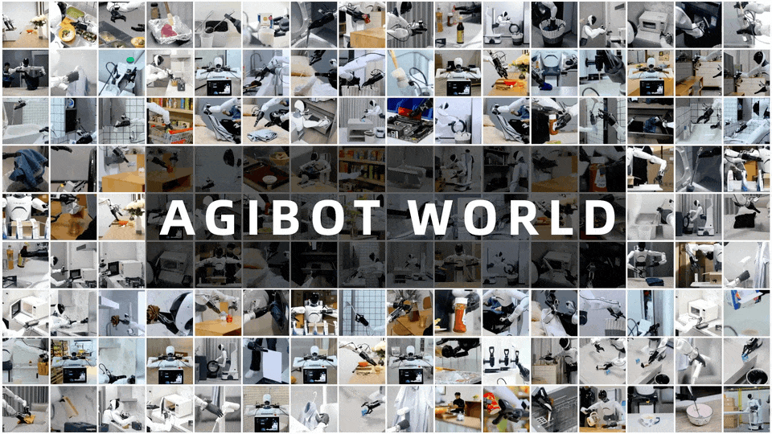

每周精选最具潜力的 AI 开源工具与技术。我们为你解析项目亮点与应用场景，并推荐实用资源，帮助你在 AI 开发中领先一步！无论是学习还是实践，《开源 AIGC 周刊》都是你的每周灵感来源！

## 本周不可错过的 AI 开源项目

### [LatentSync 🌟 600](https://github.com/bytedance/LatentSync)
LatentSync 是字节推出的开源嘴形同步模型，效果很好。 LatentSync 基于Stable Diffusion，针对时间一致性做了优化，推理只需要6.5G显存。

### [StereoCrafter：一键将普通视频转为 3D 视频 🌟 78](https://github.com/TencentARC/StereoCrafter)

腾讯开源 StereoCrafter, 能够将任何普通视频转换为红蓝、VR 或左右格式的 3D 视频。

### [try-off-anyone  🌟 87](https://github.com/ixarchakos/try-off-anyone)
try-off-anyone 用于从人物照片中提取上衣，实现所谓的“反向试穿”。

### [华佗GPT o1 🌟478](https://github.com/FreedomIntelligence/HuatuoGPT-o1)
HuatuoGPT-o1 是专为高级医学推理设计的医学 LLM。它可以识别错误、探索替代策略并完善答案。它利用可验证的医学问题和专门的医学验证器，通过以下方式推进推理：

### [CogAgent-9B-20241220 🌟 453](https://github.com/facebookresearch/AnimatedDrawings)
智谱最新开源的 CogAgent-9B-20241220 模型，类似于 Claude Computer use。例如，下方例子是CogAgent 祝你圣诞快乐，让大模型自动为你的朋友们送上圣诞祝福吧。

### [smolagents 🌟 2.6k](https://huggingface.co/blog/smolagents)
smolagents：快速搭建Agent的代码库。核心代码简洁，仅一千行代码，支持实现写代码的Agent、支持沙盒环境运行、支持多种工具和模型。

### [AgiBot-World 🌟 979](https://github.com/OpenDriveLab/Agibot-World)
AgiBot-World 包含了来自 100 个机器人的 100 多万条轨迹。其中包括100 多个 1:1 复制的真实场景，横跨 5 个目标领域。

## 最新行业动态
### 1. [DeepSeek-V3 发布：性能领先，速度飞跃，API 定价调整](https://github.com/deepseek-ai/DeepSeek-V3)

DeepSeek-V3 首个版本正式上线并同步开源。该模型在多项评测中超越了 Qwen2.5-72B 和 Llama-3.1-405B 等其他开源模型，并在性能上与世界顶尖的闭源模型 GPT-4o 相媲美。之前令人诟病的吐字速度从 20 TPS 大幅提高至 60 TPS，比 V2.5 提升了 3 倍。

不过，此次更新也在预期内调整了 API 服务定价，每百万输入 tokens 2 元（涨价 2 倍），每百万输出 tokens 8 元（涨价 4 倍）。官方为了过渡此次涨价，还特意提供了 45 天的优惠价格体验期，至 2025 年 2 月 8 日起 API 价格将恢复至新版本的价格，也算是良心。

### 2. [PixVerse V3.5](https://app.pixverse.ai/onboard)

只需20秒就能生成8秒长的视频（640*352），质量也还可以。

## 本周 AI 教程
1.[谷歌 Agents 白皮书](https://www.kaggle.com/whitepaper-agents)

介绍了Agent的基础概念和基于LangChain的简单实现。

## 关于周刊

开源 AIGC 周刊，为你挑选最值得分享的文章、教程、开源项目、副业变现等内容。希望帮助所有读者学习 AIGC，并增长职业和副业的收入。

周刊在 Github [开源](https://github.com/YOYZHANG/open-source-ai-weekly)，可以通过 issue [投稿](https://github.com/YOYZHANG/open-source-ai-weekly/issues/new)。
