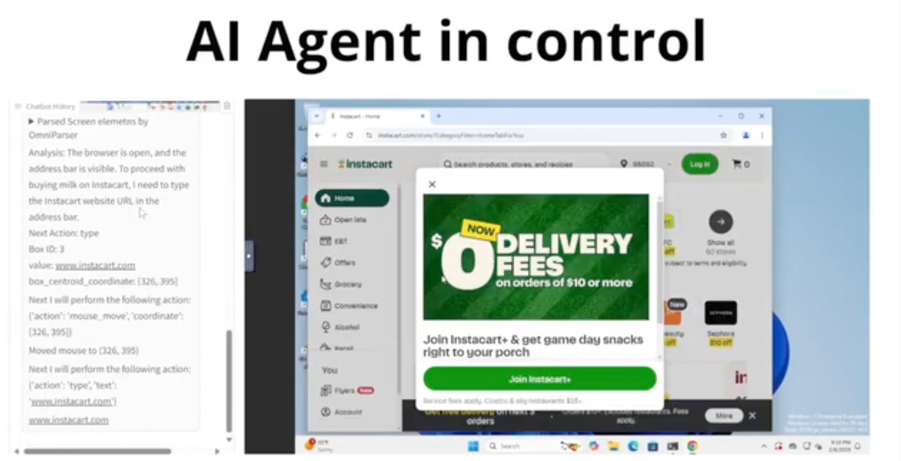
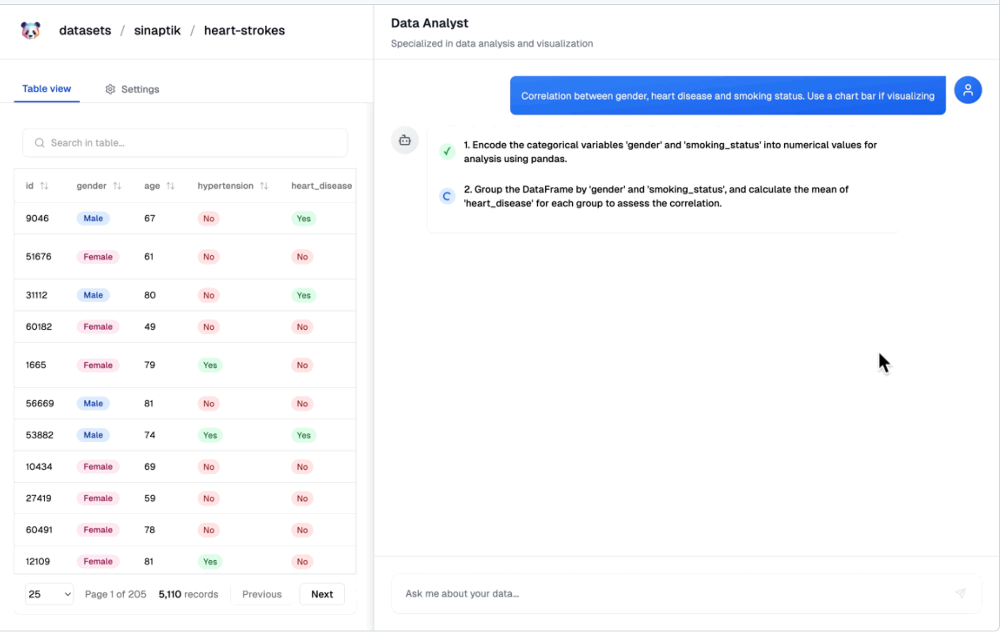

每周精选最具潜力的 AI 开源工具与技术。我们为你解析项目亮点与应用场景，并推荐实用资源，帮助你在 AI 开发中领先一步！无论是学习还是实践，《开源 AIGC 周刊》都是你的每周灵感来源！

## 本周不可错过的 AI 开源项目

### [whisper 🌟 74.7k](https://github.com/openai/whisper?tab=readme-ov-file)

OpenAI 开源了一款语音自动识别系统，支持多语言(包含中文)，同时提供了API接口。可以用来为视频自动生成字幕、实时将会议内容转录，语言学习等。

### [zerox 🌟 8.7k](https://github.com/getomni-ai/zerox?tab=readme-ov-file)
zerox 能够将pdf文件转成markdown 格式，

### [CopilotKit 🌟 15.7k](https://github.com/CopilotKit/CopilotKit)
CopilotKit 提供了多种 API 接口，允许开发者轻松地将 AI 功能集成到他们的应用中，例如自动补全、智能推荐等。官方提供了很多应用示例，有兴趣的可以看看。

### [LocalAI 🌟 28.8k](https://github.com/mudler/LocalAI)
LocalAI 是 OpenAI、Claude 和其他软件的免费开源替代品。 可以自托管，本地优先。 可直接替代 OpenAI 在硬件上运行。 无需 GPU。 可运行 gguf、变压器、扩散器和更多模型架构。 功能 生成文本、音频、视频、图像、语音克隆、分布式、P2P 推理。

### [MangaNinja 🌟 341](https://github.com/ali-vilab/MangaNinjia)
MangaNinja 是一款创新的开源线稿上色工具，它允许用户通过输入线稿和参考图片来生成与参考图一致的颜色。 该工具支持多角色草图参考多张图片和单角色草图参考多张图片。 

### [Kokoro-TTS  2k](https://huggingface.co/hexgrad/Kokoro-82M)
Kokoro 是一个前沿的 TTS 模型，仅有 82M参数（文本输入/音频输出）， 支持中文。 截至 2025 年 1 月 2 日，已发布了 10 个独特的语音包。 在发布前的几周，Kokoro v0.19 是 TTS Spaces Arena 排名第一的模型。 

### [awesome-cursorrules  6.6k](https://github.com/PatrickJS/awesome-cursorrules)
awesome-cursorrules 集合了所有超赞 .cursorrules 文件。 .cursorrules 文件定义了Cursor AI在生成代码时要遵循的自定义规则，让你可以根据自己的特定需求和偏好来调整它的行为。

## 最新行业动态
### 1. [阿里 WANX 2.1 视频生成模型即将开源](https://www.cursor.com/blog/series-b)

Cursor 官方发布已经从 Thrive Capital、Andreessen Horowitz、Benchmark 和现有投资者那里获得了 1.05 亿美元的 B 轮融资。 这笔融资将用来打造一个比任何现有人类程序员都厉害的 AI 程序员。

### 2. [OpenAI 推出 ChatGPT 任务功能：支持单次和计划任务](https://x.com/OpenAI/status/1879267274185756896?mx=27)

ChatGPT 推出了任务（Task） 功能。只要告诉 ChatGPT 需求和时间，它就会准时通知你。 目前，这一功能仅对付费用户开放。

### 3. [FLUX Pro Finetuning API：轻松定制你的图像模型](https://blackforestlabs.ai/announcing-the-flux-pro-finetuning-api/)

黑森林实验室宣布推出 FLUX Pro Finetuning API，创作者可以用自己的图像和概念来定制 FLUX.1 [pro]，从而对最终结果有更多的控制权。

## 本周 AI 教程
1.[minimind 🌟 5.5k](https://github.com/jingyaogong/minimind)

minimind 是一个用3小时完全从0训练出来的小参数GPT。该项目同时提供了详细的数据集和训练方法，能帮助大家更好的学习如何训练模型。

## 关于周刊

开源 AIGC 周刊，为你挑选最值得分享的文章、教程、开源项目、副业变现等内容。希望帮助所有读者学习 AIGC，并增长职业和副业的收入。

周刊在 Github [开源](https://github.com/YOYZHANG/open-source-ai-weekly)，可以通过 issue [投稿](https://github.com/YOYZHANG/open-source-ai-weekly/issues/new)。
