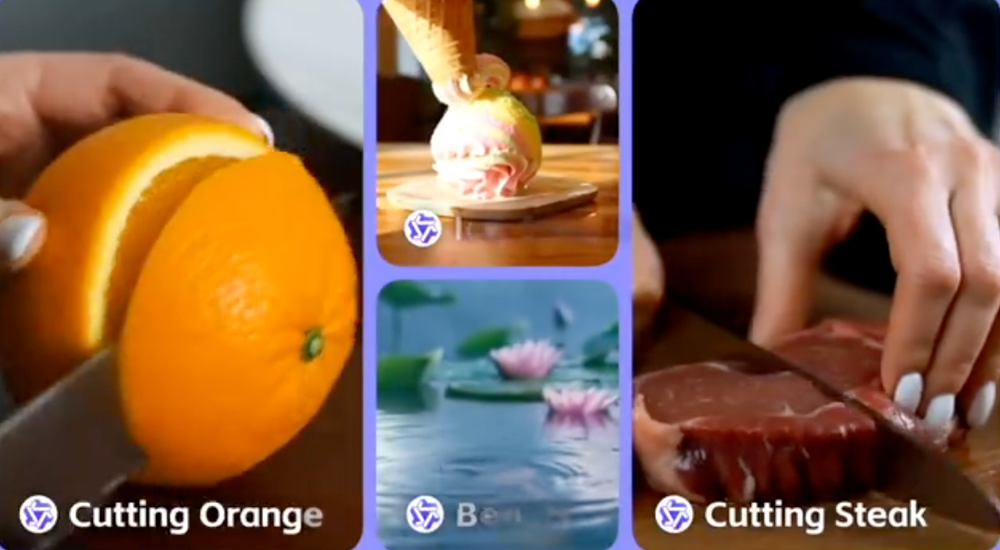

每周精选最具潜力的 AI 开源工具与技术。我们为你解析项目亮点与应用场景，并推荐实用资源，帮助你在 AI 开发中领先一步！无论是学习还是实践，《开源 AIGC 周刊》都是你的每周灵感来源！

## 本周不可错过的 AI 开源项目

### [R1 1776  🌟 1.48k](https://huggingface.co/perplexity-ai/r1-1776)

R1 1776 是 Perplexity 开源的无审查版本的 DeepSeek 推理模型，支持通过 Sonar API 方式调用。

### [Mastra 🌟 4.7k](https://github.com/mastra-ai/mastra)
Mastra 是一个 Typescript 框架，可快速构建人工智能应用程序和功能。 它提供了工作流、代理、RAG、集成功能。可以在本地机器上运行 Mastra，也可以部署到服务器上。

### [browser-use 🌟 31.4k](https://github.com/browser-use/browser-use?tab=readme-ov-file)

browser-use 是将 Agent 与浏览器连接起来的最简单方法。例如你可以利用它实现将商品加入购物车并下单；阅读你的简历并自动在浏览器中申请工作。

### [pandas-ai 🌟 15.4k](https://github.com/sinaptik-ai/pandas-ai)
pandas-ai 用于与数据库或数据集（SQL、CSV、parquet）聊天。 PandasAI 使用 LLM 和 RAG 使数据分析成为对话式的。

### [tinygrad🌟 28.1k](https://github.com/tinygrad/tinygrad)
tinygrad 是一款出色的深度学习框架，它的架构其极其简单，并支持推理和训练。 如果说 XLA 是 CISC，那么 tinygrad 就是 RISC。

### [Light-A-Video  330](https://github.com/bcmi/Light-A-Video/)
Light-A-Video 是一个开源的无需训练的视频重打光技术，效果类似于 IC-Light，但特别之处在于它支持视频处理。

### [Step-Video-T2V  2k](https://github.com/stepfun-ai/Step-Video-T2V)
Step-Video-T2V 开源了其最新的文生视频模型，该模型拥有 300 亿参数，能够生成长达 204 帧的高质量视频。官方建议使用配备 80G 内存的 GPU 进行运行。代码已基于 MIT 许可证开源，支持商业用途。

## 最新行业动态
### 1. [阿里 WANX 2.1 视频生成模型即将开源](https://x.com/Alibaba_WanX)
WanX 团队昨晚宣布即将开源其最新的 WANX 2.1 视频生成模型。

### 2. [Grok3 Beta 已可以免费使用](https://grok.com/)

Grok3 其计算能力是之前最先进模型的 10 倍，支持深度思考功能，但该功能 24 小时内只能使用 2 次。

### 3. [腾讯混元 T1 推理模型现已上线腾讯元宝](https://mp.weixin.qq.com/s/q5YFZrcTDYgM-LeRyGHQYQ)

腾讯混元团队宣布其自研推理模型 Hunyuan T1 现已上线腾讯元宝进行灰度测试，性能比肩 Deepseek R1。

### 4. [微软推出 OmniParser V2.0：将大语言模型转化为 GUI 交互智能体](https://huggingface.co/microsoft/OmniParser-v2.0)
微软的 OmniParser 近日发布了 V2 更新，这一更新旨在将任何大语言模型（LLM）转化为能够理解和交互图形用户界面（GUI）的智能体。

### 5. [百度文心大模型 4.5 系列即将开源](https://mp.weixin.qq.com/s/VEPMufLTlSyysy1cmyHk4Q)

百度将在未来几个月中陆续推出文心大模型4.5系列，并于6月30日起正式开源。同时，百度搜索也将全面接入 DeepSeek 和文心大模型最新的深度搜索功能。

### 6. [谷歌 Whisk：通过图像混合生成新图片](https://labs.google/fx/tools/whisk)

Whisk 是谷歌实验室的新实验项目，用户可以通过上传或生成图像来定义主题、场景和风格，然后将它们混合生成新图片。

## 本周 AI 教程
1.[antropics 🌟 9.4k](https://github.com/anthropics/courses)

Antropics 官方推出的教程包含以下内容：
- Claude SDK 的使用：获取 API 密钥、使用模型参数、编写多模态提示、流式响应等。 
- Prompt教程：关键提示技术的全面分步指南。
- 真实世界提示：学习如何将提示技术融入复杂的真实世界提示中。
- 提示评估：学习如何编写生产提示评估，以衡量提示的质量。
- 工具使用：讲授在使用 Claude 的工作流程中成功实施工具使用所需的一切知识。

## 关于周刊

开源 AIGC 周刊，为你挑选最值得分享的文章、教程、开源项目、副业变现等内容。希望帮助所有读者学习 AIGC，并增长职业和副业的收入。

周刊在 Github [开源](https://github.com/YOYZHANG/open-source-ai-weekly)，可以通过 issue [投稿](https://github.com/YOYZHANG/open-source-ai-weekly/issues/new)。
